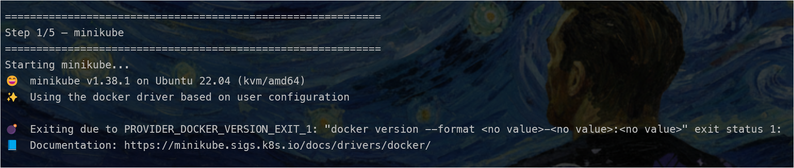
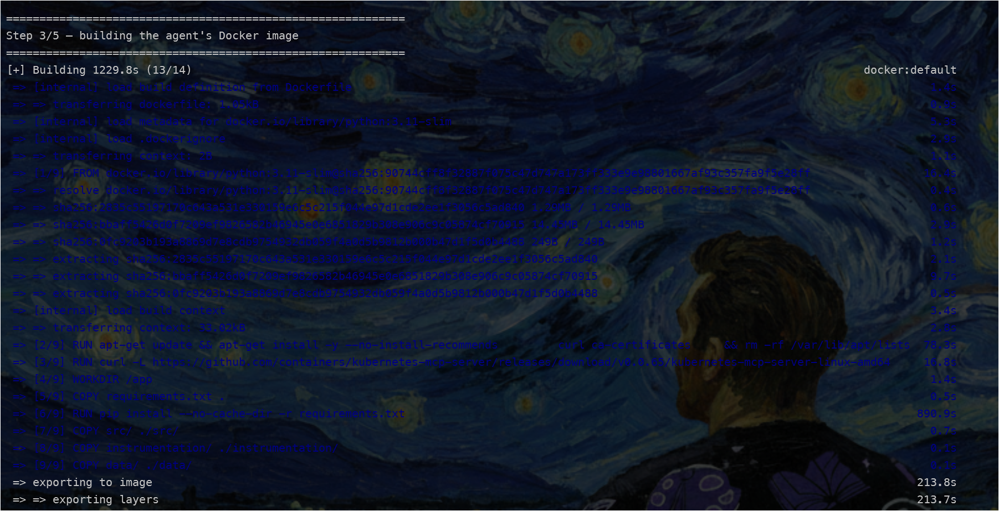
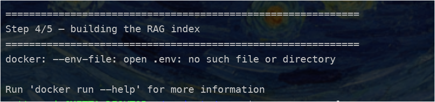
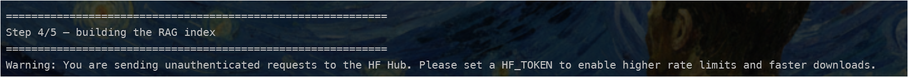

# FAQ / Troubleshooting

Quick answers to the most likely things you'll hit running `setup.sh`. For
the full blow-by-blow of how each of these was actually diagnosed, see
[`docs/observations.md`](observations.md) — this page is the short version.

---

### 1. `minikube` fails with `PROVIDER_DOCKER_VERSION_EXIT_1` / `docker version --format <no value>...`

**Screenshot:**



Docker isn't actually reachable. Check what's really going on:

```bash
docker version
systemctl status docker
```

- **`docker` command not found, but Docker Desktop is installed on
  Windows** → you only have Docker Desktop's WSL integration stub, not a
  real install. Don't enable Desktop's WSL integration — install native
  Docker Engine instead (see [`docs/setup.md`](setup.md#1-docker-engine)).
  Desktop's virtualization layer is exactly what causes the ClickHouse
  Keeper crash bug mentioned throughout these docs.
- **`docker.io` or a snap version is installed** → remove it first, it
  conflicts with the official apt package:
  ```bash
  sudo apt-get remove -y docker.io docker-doc docker-compose docker-compose-v2 podman-docker containerd runc
  sudo snap remove docker 2>/dev/null || true
  ```
  then follow the fresh-install steps in `docs/setup.md`.
- **Nothing installed at all** → follow [`docs/setup.md`](setup.md#1-docker-engine)'s
  fresh install steps.

### 2. WSL2 terminates entirely mid-`docker build` (jumps back to a Windows/PowerShell prompt)

**Screenshot:**



**You're running the project from `/mnt/c/...` or `/mnt/d/...`** — a
Windows drive mounted into WSL2. File I/O across that boundary is
drastically slower than WSL2's native filesystem, and under the sustained
I/O load of a `docker build` (installing packages, exporting layers), it
can push the WSL2 VM over a resource ceiling and get it killed by Windows
— with no error message, just a dead session.

**Fix — move the project onto WSL2's native filesystem:**

```bash
mkdir -p ~/projects
cp -r /mnt/d/path/to/argus ~/projects/argus
cd ~/projects/argus
```

`setup.sh` itself will warn you at startup if it detects this before you
even hit the build step. Also worth giving WSL2 more headroom via
`.wslconfig` — see [`docs/setup.md`](setup.md#0-windows-only--wsl2).

### 3. Step 4/5 fails: `docker: --env-file: open .env: no such file or directory`

**Screenshot:**



No `.env` in the project root — `docker build` doesn't need one, so a
missing `.env` doesn't surface until Step 4, the first step that actually
reads it.

```bash
cp .env.example .env
# fill in GROQ_API_KEY (or OPENROUTER_API_KEY)
./setup.sh
```

Re-running is cheap once minikube/SigNoz/the Docker image are already up
— it skips straight to Step 4.

### 4. `Warning: You are sending unauthenticated requests to the HF Hub...`

**Screenshot:**



Harmless — `sentence-transformers` is downloading the embedding model
anonymously, which is slower and can hit rate limits but isn't fatal. Add
a free token to speed it up:

```dotenv
HF_TOKEN=hf_xxxxxxxxxxxx
```

Get one at https://huggingface.co/settings/tokens (read access is enough).

### 5. Traces don't show up in SigNoz right after the very first run

Likely just a cold-start propagation delay — SigNoz's ClickHouse schema
was created moments earlier by `foundryctl cast`, and newly-seen-service
detection in the UI can lag slightly behind the very first write on a
brand new stack. `setup.sh` already waits for the OTLP collector port to
respond before running scenarios, which covers most of this, but if it
still happens: wait ~30s–1min, refresh the SigNoz UI, or just run a
scenario again — traces show up reliably after that.

### Something else

Check [`docs/observations.md`](observations.md) for the full history —
it's a running log of everything hit while testing this project, kept in
more detail than this page. If you hit something new, that's the place to
add it.
