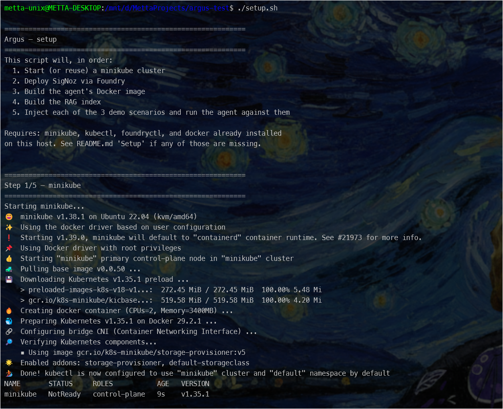
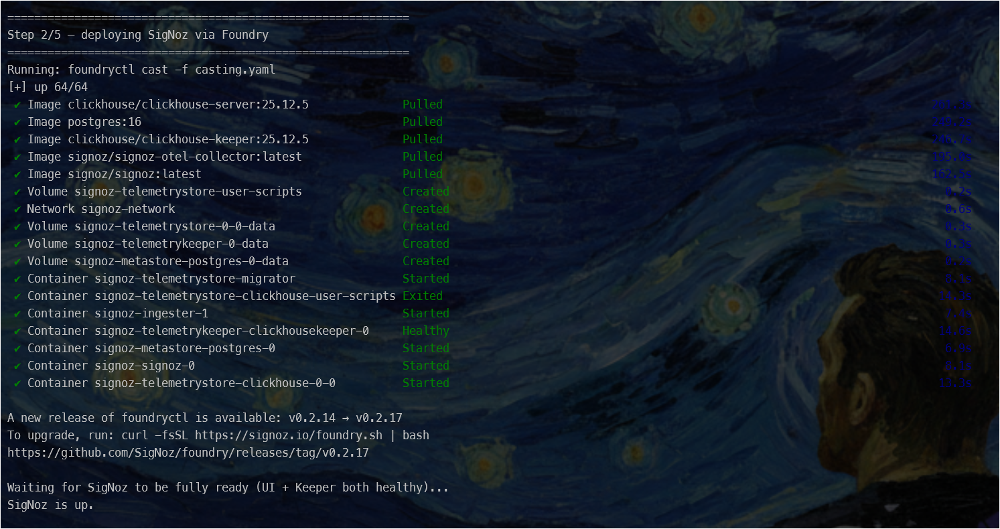
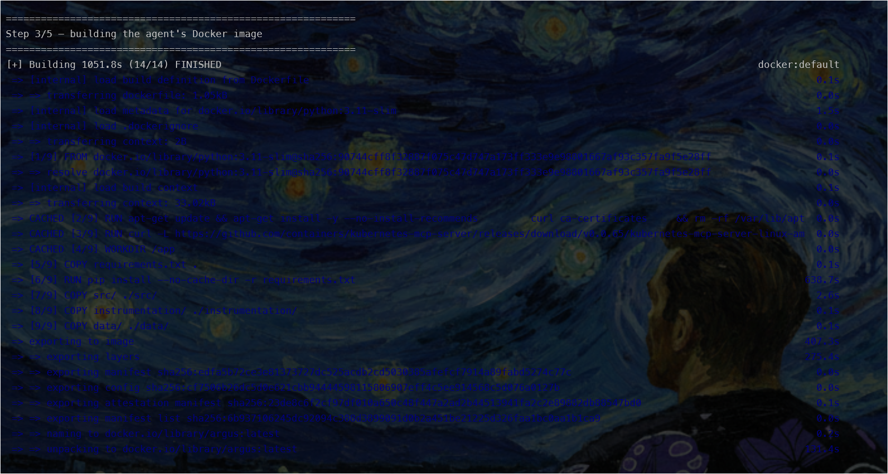
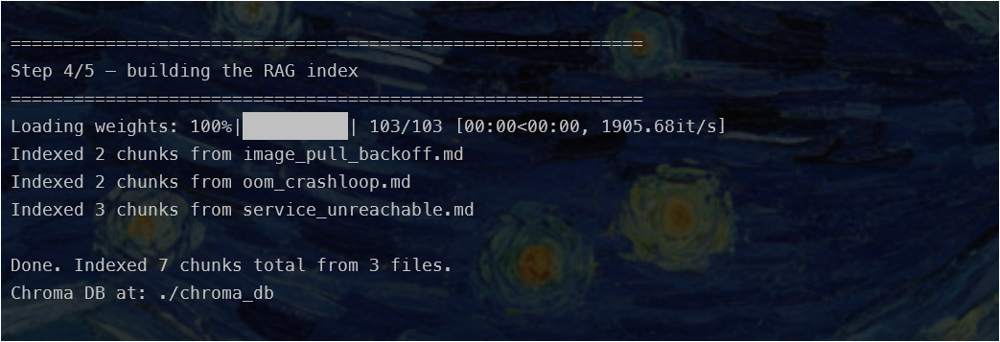
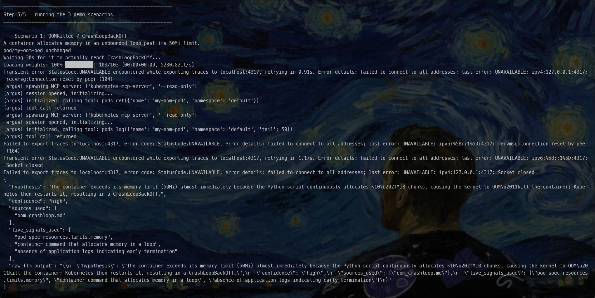
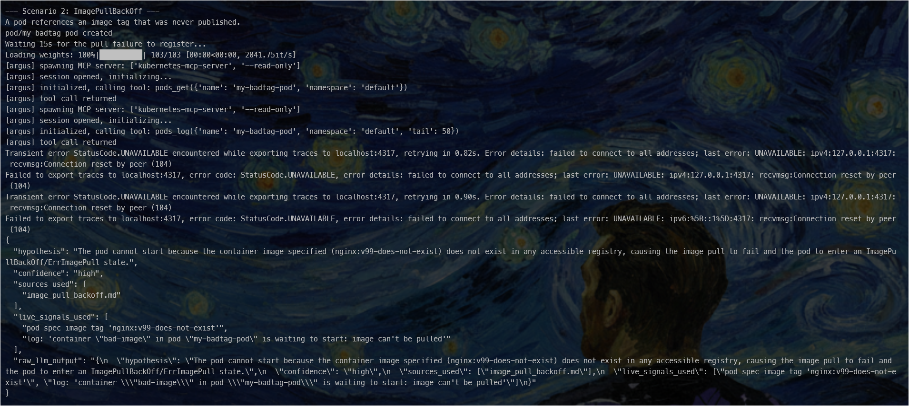
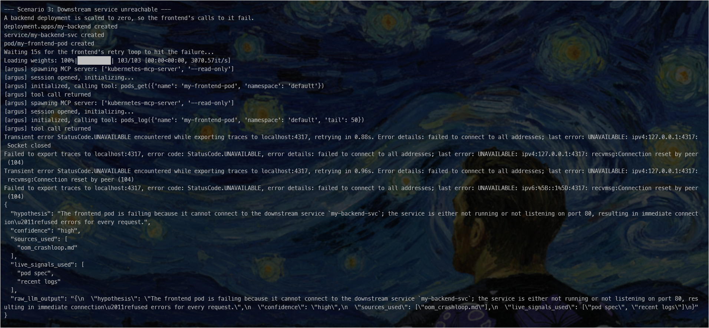
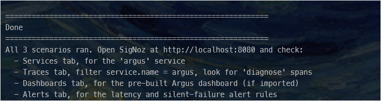

# Setup guide

Full walkthrough from a bare machine to a running Argus + SigNoz stack. If
you already have some of these tools, skip straight to whichever step you
need. For a quick summary instead of this full walkthrough, see the
[README](../README.md#prerequisites).

- [0. Windows only — WSL2](#0-windows-only--wsl2)
- [1. Docker Engine](#1-docker-engine)
- [2. minikube + kubectl](#2-minikube--kubectl)
- [3. foundryctl](#3-foundryctl)
- [4. Get the repo running](#4-get-the-repo-running)
- [5. Screenshots](#5-screenshots-of-setupsh-execution)
- [Stopping and cleaning up](#stopping-and-cleaning-up)
- [Troubleshooting](#troubleshooting)

---

## 0. Windows only — WSL2 :

SigNoz's ClickHouse Keeper segfaults under Docker Desktop's virtualization
layer on Windows. This project needs **native Docker Engine running inside
WSL2**, not Docker Desktop. macOS/Linux users: skip to step 1.

1. Install WSL2 with an Ubuntu distro: follow Microsoft's official guide —
   https://learn.microsoft.com/windows/wsl/install
2. Confirm systemd is enabled (needed later for `systemctl`):
   ```bash
   cat /etc/wsl.conf
   ```
   It should contain:
   ```ini
   [boot]
   systemd=true
   ```
   If it doesn't, add it, then from PowerShell run `wsl --shutdown` and
   reopen your WSL terminal for it to take effect.
3. From here on, run **every command in this guide inside your WSL2 Ubuntu
   shell**, not PowerShell.
4. **Put the project on WSL2's native filesystem, not `/mnt/c/...` or
   `/mnt/d/...`.** Those paths are Windows drives mounted into WSL2, and
   file I/O across that boundary is drastically slower than native disk —
   badly enough that a `docker build` under that load has been observed to
   crash the entire WSL2 VM mid-build (15+ minute `pip install`, then the
   whole session dies with no error, see [`docs/faq.md`](faq.md)). Clone
   or copy the project somewhere under your Linux home directory instead:
   ```bash
   mkdir -p ~/projects
   git clone <your-repo-url> ~/projects/argus
   cd ~/projects/argus
   ```
   `setup.sh` itself checks for this and warns loudly if it detects the
   project running from `/mnt/...` under WSL2.

See also [Installing SigNoz on Windows: the Fastest Way](https://medium.com/@mettasurendhar/installing-signoz-on-windows-the-fastest-way-5-minutes-no-docker-desktop-eb7c581ff246)
for the condensed version of this exact path.

## 1. Docker Engine :

### If Docker is already installed

Check what you actually have before doing anything else:

```bash
docker version
systemctl status docker
```

- **Works cleanly, both commands succeed** → you're done, skip to step 2.
- **`docker` command not found, but you have Docker Desktop on Windows** →
  you only have Docker Desktop's WSL integration stub, not a real install.
  Follow "Fresh install" below instead of enabling Desktop's WSL
  integration — the ClickHouse Keeper bug mentioned above is specifically
  about running through Desktop's virtualization layer.
- **`docker.io` or a snap version is installed** → this can conflict with
  the official apt package. Remove it first:
  ```bash
  sudo apt-get remove -y docker.io docker-doc docker-compose docker-compose-v2 podman-docker containerd runc
  sudo snap remove docker 2>/dev/null || true
  ```
  then continue with "Fresh install" below.
- **Docker Desktop is installed and its WSL integration is turned on for
  this distro** → turn it off (Docker Desktop → Settings → Resources → WSL
  Integration) so it doesn't fight with the native install for the
  `docker` command/socket, then continue below.

### Fresh install (native Docker Engine via apt)

```bash
# Remove any conflicting/unofficial packages (safe even if none are installed)
for pkg in docker.io docker-doc docker-compose docker-compose-v2 podman-docker containerd runc; do
  sudo apt-get remove -y $pkg
done

# Add Docker's official GPG key + apt repo
sudo apt-get update
sudo apt-get install -y ca-certificates curl
sudo install -m 0755 -d /etc/apt/keyrings
sudo curl -fsSL https://download.docker.com/linux/ubuntu/gpg -o /etc/apt/keyrings/docker.asc
sudo chmod a+r /etc/apt/keyrings/docker.asc

echo \
  "deb [arch=$(dpkg --print-architecture) signed-by=/etc/apt/keyrings/docker.asc] https://download.docker.com/linux/ubuntu \
  $(. /etc/os-release && echo "$VERSION_CODENAME") stable" | \
  sudo tee /etc/apt/sources.list.d/docker.list > /dev/null

# Install Docker Engine + plugins
sudo apt-get update
sudo apt-get install -y docker-ce docker-ce-cli containerd.io docker-buildx-plugin docker-compose-plugin

# Start it, enable on boot
sudo systemctl enable --now docker

# Let your user run docker without sudo
sudo usermod -aG docker $USER
```

**Important:** after `usermod`, fully close and reopen your terminal (WSL:
close the window, or `wsl --shutdown` from PowerShell and reopen) — group
membership doesn't apply to your already-open shell.

### Verify

```bash
docker run hello-world
```

If this prints the "Hello from Docker!" message, you're ready for step 2.

## 2. minikube + kubectl :

```bash
# minikube
curl -LO https://storage.googleapis.com/minikube/releases/latest/minikube-linux-amd64
sudo install minikube-linux-amd64 /usr/local/bin/minikube
rm minikube-linux-amd64
minikube version

# kubectl (skip if you already have it)
curl -LO "https://dl.k8s.io/release/$(curl -L -s https://dl.k8s.io/release/stable.txt)/bin/linux/amd64/kubectl"
sudo install -o root -g root -m 0755 kubectl /usr/local/bin/kubectl
rm kubectl
kubectl version --client
```

Full docs / other platforms: https://minikube.sigs.k8s.io/docs/start/

You don't need to `minikube start` manually — `setup.sh` starts (or reuses)
the cluster itself. If you want to sanity-check this step in isolation
first: `minikube start --driver=docker`, then `minikube delete` when done
so `setup.sh` starts clean.

## 3. foundryctl :

Deploys SigNoz.

```bash
curl -fsSL https://signoz.io/foundry.sh | bash
```

Full docs / manual install (e.g. air-gapped environments):
https://github.com/SigNoz/foundry/blob/main/docs/getting-started.md

## 4. Get the repo running :

```bash
git clone <your-repo-url> argus
cd argus
cp .env.example .env   # fill in your GROQ_API_KEY (or OPENROUTER_API_KEY)
chmod +x setup.sh
./setup.sh
```

**Windows/WSL2** run this from inside your WSL2 Ubuntu shell, in a
directory under your Linux home (e.g. `~/projects/argus`) — not `/mnt/c/`
or `/mnt/d/`. See step 0 above for why.

> Note:
> `setup.sh` starts (or reuses) a minikube cluster, deploys SigNoz via Foundry, builds the agent's Docker image, builds the RAG index, then injects each of the 3 demo scenarios and runs the agent against them in sequence — printing what it's doing at every step. It runs minikube and Foundry directly on the host rather than through a container's mounted docker socket; see the script's own header comment for why.
>
> If you'd rather run things by hand instead of the full sequence (re-run a single scenario, work outside Docker, poke at an intermediate step), see the README's ["Running things by hand"](../README.md#running-things-by-hand) section.

## 5. Screenshots of setupsh execution:










## Stopping and cleaning up

### Quick check — what's actually running

```bash
minikube status
docker ps
```

### Pause everything (keeps all data, fast to resume)

```bash
minikube stop
docker stop $(docker ps -q --filter "name=signoz-")
```

### Full teardown (frees all resources, next run starts clean)

```bash
# 1. Delete the minikube cluster entirely
minikube delete

# 2. Tear down the SigNoz stack (foundryctl has no "down" command — it only
#    has gauge/forge/cast/gen — so use the compose file it generated)
docker compose -f pours/deployment/compose.yaml down
# add -v to also delete SigNoz's stored data (traces, dashboards, alerts):
# docker compose -f pours/deployment/compose.yaml down -v
```

### Confirm it's actually stopped

```bash
docker ps -a       # should show no signoz-* or minikube containers running
minikube status     # should report "Profile ... not found" or similar
```

## Troubleshooting

Quick answers to the most likely errors are in
[`docs/faq.md`](faq.md) — check there first. For the full detail on how
each was actually diagnosed (useful if the quick fix doesn't match your
situation exactly), see [`docs/observations.md`](observations.md). If you
hit something new, that's the place to add it.
